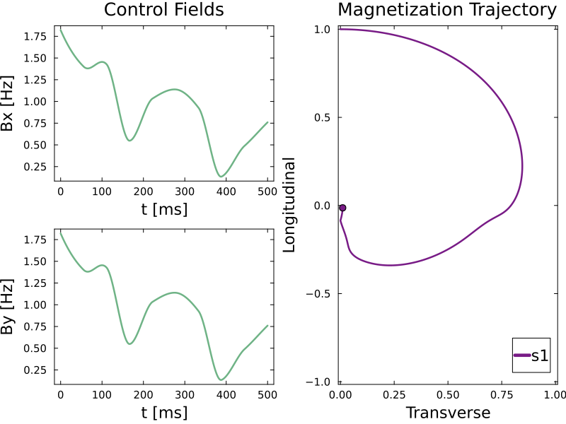

# Introduction
GrapeMR.jl is a Julia package designed for optimizing radio-frequency (RF) pulses in NMR/MRI applications using the GRAPE (Gradient Ascent Pulse Engineering) algorithm. It enables the optimization of magnetic systems and supports various cost functions. It also comes with the option of hyperparameter search to handle more complex optimization problems. GrapeMR.jl can be applied in MRI for pre-acquisition pulse preparation, signal enhancement, and metabolomics for signal filtering.

# Getting Started 

## Installing GrapeMR
To use GrapeMR.jl, you’ll first need to install Julia, which can be downloaded from (here)[https://julialang.org/downloads/]. Once Julia is installed, open the Julia REPL and add GrapeMR as follows:

```julia-repl
julia> ]
(@v.1.11) pkg> add GrapeMR
```

## Implementation example
A straightforward implementation involves creating a TOML file to define the system’s initial state, inhomogeneities, and relaxation values. The user will specify a cost function, the control field duration, and a path to save the output. A folder will be created in the GrapeMR installation directory if no path is provided. The package includes a default configuration file that you can modify or replace with your own.

### Sample TOML file
```toml
title = "GrapeMR Configuration"
plot = true

[spins]
M0         = [0.0, 0.0, 1.0]
delta_B1   = [1.0]
offset     = 0.0
intrinsics = [
    {T1 = 0.6, T2 = 0.3, label = "s1", target = "Center of Bloch's Ball"},
]

[grape_parameters]
time_steps      = 2000
cost_function   = "euclidean_norm"
fields2optimize = {"B1x" = true, "B1y" = true, "Bz" = false}


[optimization_parameters]
hyper_opt    = false
poly_start   = 0.1
poly_degree  = 1
max_iter     = 5000

[control_field]
control_time = 0.5
B1ref = 1.0

[save_files]
enabled = true
export_bruker = true
folder_path = "/tmp/"
bruker_folder_path = "/tmp/"
```

### Run Configuration
Run the configuration file with:
```julia-repl
julia> using GrapeMR
julia> run_grape_optimization("src/default_config.toml")
```

### Results
After running the optimization, a grape_output.jld2 file is generated along with a plot of the optimized control field:



The RF pulse analysis is displayed after the optimization:

```julia
 Final cost value = 0.0052 

---------- RF Analysis ---------- 

Pulse Peak Amplitude = 2.5804 [Hz]
Pulse Peak Amplitude = 0.0606 [μT]
Attenuation corresponding to maximum amplitude: 56.0692 [dB]
Maximum power = 0.7862 [W]
Average power = 0.244 [W]
Pulse energy = 0.122 [J]
```