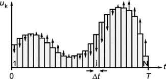

# GrapeMR.jl


Documentation for GrapeMR.jl
# Magnetic systems 
- Given a homogeneus magnetic field $\vec{B}_0 = |B_0|\textbf{z}$ 
- Magnetic moments align with $\vec{B}_0$ resulting in a bulk magnetization $M_0$ along the z-axis.
- The presence of $\vec{B}_0$ gives raise (?) to a resonance condition specific for each atomic nuclei.
```math
\omega_0 = -\gamma B_0
```
where $\omega_0$ [rads/s] is the Larmor frequency, $\gamma$ [rads/s/T]  the gyromagnetic ratio and $B_0$ [T] the homogenios magnetic field. 
- An inhomogeneous magnetic field $B_1(t)$, perpendicular to $B_0$, when irradiated in the resonance frequency, rotates the magnetization. The rotation angle is described as, 
```math
\alpha = 2 \pi \gamma B_1 \Delta t
```
where $\Delta t$ is the duration of the $B_1(t)$ field. Because the gyromagnetic ratio of the proton is O(MHz), so is the $B_1(t)$, hence, radio frequency field. It can be rewritten as a combination of its x-y components, $B_1(t) = B_1x + i B_1y$. 
- Once $B_1(t)$ is turned off, the system starts to relax back to equilibrium, generating a signal called FID (Free Induction Decay).
- The relaxation parameters, $T_1$ and $T_2$, are individual to each molecule, therefore, generating different decays for different molecules excited by the same RF pulse.
- From the signal detected, one can calculate the magnetization values.


# Optimal Control
## Description of System Dynamics
The dynamics of a system can be mathematically described by the following system of equations:
```math
\begin{cases}
    \dot{\vec{x}}(t) = \vec{f}(x(t)) \\
    x(0) = x_0 (t > 0)
\end{cases}
```
Here, $\vec{f}$ represents all of the forces acting on the system. In a control dynamics, a function $u(t)$, called the control function, is introduced to allow for manipulation of the system. The system dynamics can now be written as:
```math
\begin{cases}
    \dot{\vec{x}}(t) = \vec{f}(x(t), u(t)) \\
    x(0) = x_0 (t > 0). 
\end{cases}
```
The goal in this type of system is to find the "best set" of controls. To achieve this, a reward function $C$ is introduced. If $u^*(t)$ is the optimal control, then for all $u(t)$, the reward function satisfies:
```math
C(u^*) ≥ C(u).
```

## Optimal Control in NMR
In Nuclear Magnetic Resonance (NMR), a controled dynamics can be achieved by designing the RF pulses as the controls. Hence, the magnetization dynamics would be proportional to,
```math
\dot{M}(t) = f(M_0, T_1, T_2, B_1(t), M(t))
```

More specifically, the dynamics are governed by the Bloch Equations, which can be expressed as follows:
```math
\begin{bmatrix}
    \dot{M_x} \\ \dot{M_y} \\ \dot{M_z}
\end{bmatrix} = 
\begin{bmatrix}
    -1/T_2 & \Delta B_0 & -B1_y \\
    -\Delta B_0 & -1/T_2 & B1_x \\
    B1_y & -B1_x & 1/T_1
\end{bmatrix}
\begin{bmatrix}
    M_x \\ M_y \\ M_z
\end{bmatrix} + 
\begin{bmatrix}
    0 \\ 0 \\ M_0/T_1
\end{bmatrix}
```

where the dynamics of the magnetization is described by the vector $\vec{M} = (M_x, M_y, M_z)$. 

## Cost Function
Defining a cost function is essencial in this processes since it is based on it that the system will be optimized. In the case of contrast saturation, given two samples $a$ and $b$, the goal is to supress one signal while maximizing the other. This can be achieved using the following cost function:
```math
C^{(a>b)} = ||\vec{M}^{(b)}(t_f)|| - (M_z^{(a)}(t_f))^2
```
This cost function yields the best value of $-1$ when the signal of sample $a$ is zero and the signal of sample $b$ is maximum.

## GRAPE Algorithm 
The basic algorithm for optimization is Gradient Ascent, which can be described using the following steps:
1. Choose an initial control field (can be an arbitrary smart guess);
2. Compute the cost function $C(u)$;
3. Compute the gradient $\frac{\delta C}{\delta u}$;
4. Update the current control field using the formula: $\vec{\omega}^{(n + 1)} = \vec{\omega}^{(n)} - \gamma \frac{\delta C}{\delta u}$;
5. Repeat 2-4 until convergence.

While this is the simplest way to apply the gradient ascent algorithm, a more precise approach involves using forward and backward propagation to update the control field. This approach will be discussed in the following section.




